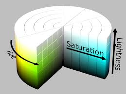

# Color y opacidad
Dentro de CSS se pueden usar una gran variedad de indicadores de colores por ejemplo :
*   **RGB**
*   **Hexadecimales**

## La propiedad de opacidad
La opacidad es la resistencia de un objeto a la luz, con la propiedad `opacity` se configura que tanto se puede ver a través del objeto.

##### Sintaxis:
```css
    E {
        opacity:'numero';
    }
``` 
Es valore "*numero*" es una fracción decimal donde 1.0 es totalmente opaco y 0.0 es totalmente transparente

## Valores de color nuevos y ampliados
En CSS3 se amplio los métodos para especificar el color y ahora son:
*   **hex**
*   **rgb**
*   **keywords**
*   **HSL**

### El canal alfa
Es la medida de la opacidad de un color, estos valores de color pueden ser heredados por elementos secundarios y se pueden anular colocando a cada uno su propio valor `RGBA`.

Este se introduce en el modelo `RGB` -> `RGBA` (*Red Green Blue Alpha*).

##### Sintaxis:
```css
    E {
        color: rgba(red,green,blue,alpha);
    }
```
Su valor es el mismo que el de opacidad en fracción decimal.

### Tono, saturación, luminosidad (Hue, Saturation, Lightness)
El nuevo sistema para notación de color es HSL el cual se basa en un circulo de color.

##### Circulo de color


La flecha que rodea el circulo es el tono, la flecha que parte desde el centro del cilindro hasta el final es la saturación y la flecha que parte desde abajo del cilindro hasta el tope es la luminosidad.

*   **tono**:Es el color que se elije
*   **saturación**:Es la intensidad del color 
*   **luminosidad**:Es el brillo que tiene el color

##### Sintaxis: 
```css
    E {
        color: hsl('tono','saturación','luminosidad');
    }
```
`tono`:Es un numero ente 0 y 360

`saturación` y `luminosidad`:Es un valor porcentual entre 0% y 100%

### HSLA
Al igual que con `RGB` se puede usar el valor `Alpha` con su misma sintaxis que `RGBA`

### La variable de color: currentColor
Se introdujo con CSS3 el valor de `currentColor` este valor toma el color de un elemento padre.
##### Sintaxis:
```css
    E { 
        "Att": "value" "value" "currentColor"; 
    }
```
